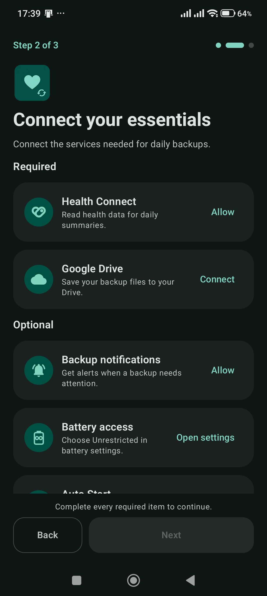
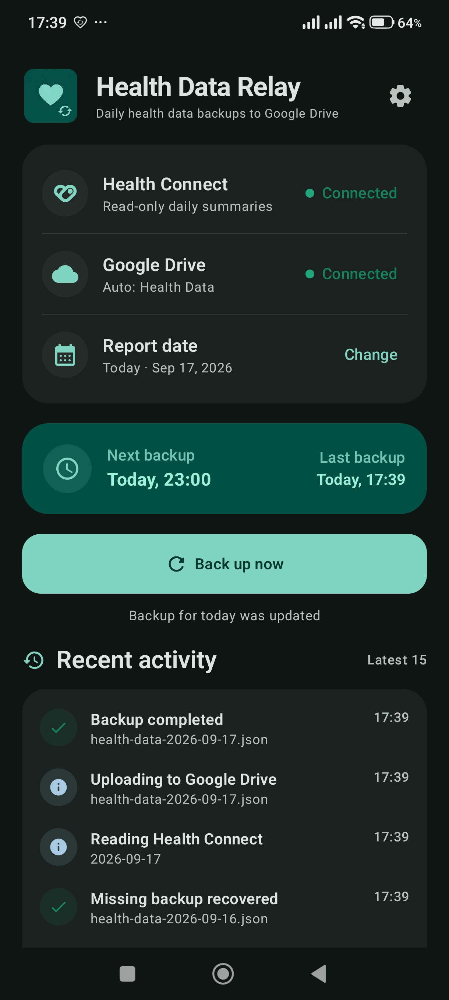
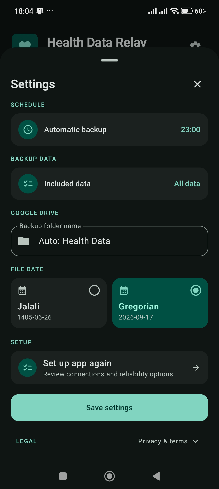
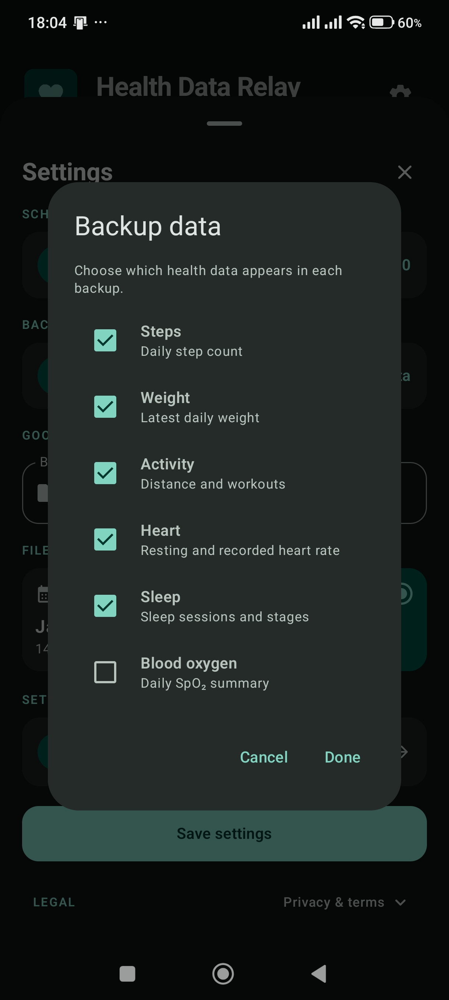

# Health Data Relay

<p align="center"><strong>An Android health data pipeline from Health Connect to your Google Drive.</strong></p>

<p align="center">
  <a href="https://github.com/Ali-Sdg90/health-data-relay/actions/workflows/ci.yml"></a>
  <a href="https://github.com/Ali-Sdg90/health-data-relay/releases/latest"></a>
  
  <a href="LICENSE"></a>
</p>

<p align="center">
  <a href="https://ali-sdg.is-a.dev/health-data-relay/">Website</a> ·
  <a href="https://github.com/Ali-Sdg90/health-data-relay/releases/latest">Download</a> ·
  <a href="https://ali-sdg.is-a.dev/health-data-relay/privacy/">Privacy</a> ·
  <a href="https://ali-sdg.is-a.dev/health-data-relay/terms/">Terms</a>
</p>

<p align="center">
  
</p>

Health Data Relay creates a direct pipeline from Health Connect to Google Drive. It reads the health categories the user approves, reduces each selected day to a compact JSON summary, and uploads the file directly to a user-owned Drive folder.

The app keeps this pipeline deliberately small: no developer backend, no analytics, no advertising, read-only Health Connect access, and the narrow Google Drive `drive.file` scope.

## Core capabilities

- Reads steps, weight, distance, workouts, heart rate, resting heart rate, sleep stages, and blood oxygen from Health Connect.
- Lets users choose which health categories appear in every backup.
- Creates one readable JSON file per day with a Gregorian filename in English or a Jalali filename in Persian by default; the file-date system can be chosen explicitly in Settings. The JSON retains an unambiguous Gregorian date.
- Supports manual backups for a selected date and automatic daily backups on a configurable schedule in `Asia/Tehran`.
- Updates an existing daily file instead of creating duplicates, automatically retries recoverable scheduled failures, and checks the previous two days for missing backups.
- Guides first-run setup in English or Persian. Health Connect and Google Drive are required; backup notifications, battery access, and supported OEM Auto Start settings are optional.
- Lets users review the guided setup again from Settings without resetting their saved backup preferences.
- Keeps recent operational activity on the device and sends notifications only for important failures, access problems, and recovered backups.

## Product gallery

<table>
  <tr>
    <td align="center"><a href="docs/assets/gallery/app-screenshot-1.jpg"></a></td>
    <td align="center"><a href="docs/assets/gallery/app-screenshot-2.jpg"></a></td>
    <td align="center"><a href="docs/assets/gallery/app-screenshot-3.jpg"></a></td>
    <td align="center"><a href="docs/assets/gallery/app-screenshot-4.jpg"></a></td>
  </tr>
  <tr>
    <td align="center"><sub><strong>Guided setup</strong></sub></td>
    <td align="center"><sub><strong>Backup dashboard</strong></sub></td>
    <td align="center"><sub><strong>Backup settings</strong></sub></td>
    <td align="center"><sub><strong>Data selection</strong></sub></td>
  </tr>
</table>

## Data pipeline

```text
Compatible health apps
        ↓
Health Connect (read only)
        ↓
Daily aggregation on the Android device
        ↓
Compact JSON summary
        ↓
User-owned Google Drive folder
```

Each selected date produces a file such as `health-data-1405-06-02.json`:

```json
{
  "date": "1405-06-02",
  "dateGregorian": "2026-08-24",
  "steps": 8432,
  "weight": 79.5,
  "activity": {
    "exerciseMinutes": 52,
    "distanceKm": 5.4,
    "workouts": [
      { "type": "walking", "durationMinutes": 47 }
    ]
  },
  "heart": {
    "resting": 52,
    "average": 81,
    "min": 46,
    "max": 138
  },
  "sleep": {
    "bedTime": "00:18",
    "wakeTime": "07:56",
    "totalMinutes": 458,
    "deepMinutes": 94,
    "remMinutes": 87
  },
  "spo2": {
    "average": 97.6,
    "min": 95.0
  }
}
```

Disabled categories are omitted. When weight is enabled but unavailable for the selected day, the field remains present as `null`.

## Architecture

| Component | Responsibility |
| --- | --- |
| `HealthConnectManager` | Permissions, record reads, daily aggregation, and overlap-safe sleep handling |
| `DailyHealthSummary` | Stable serializable contract for the daily report |
| `BackupCoordinator` | Access validation, selected-field serialization, recovery, and orchestration |
| `DriveBackupManager` | Drive folder discovery and idempotent file creation or update |
| `BackupScheduler` / `BackupWorker` | WorkManager scheduling and retry execution |
| `AppStateStore` | DataStore-backed settings, backup state, and recent activity |
| `MainScreen` / `MainViewModel` | Compose UI, onboarding, settings, and manual backup flow |

**Stack:** Kotlin · Jetpack Compose · Material 3 · Health Connect · WorkManager · DataStore · Google Identity Services · Google Drive API · kotlinx.serialization · OkHttp

## Privacy by design

- Health Connect access is read only; the app never changes health records.
- Daily summaries are created locally and uploaded directly to the user's Google Drive.
- Google Drive access uses `drive.file`, limiting the app to files it creates or the user opens with it.
- There is no developer-operated backend, analytics, advertising SDK, telemetry, or independent app account.
- Health permissions and Google authorization can be revoked at any time.

See the public [Privacy Policy](https://ali-sdg.is-a.dev/health-data-relay/privacy/) for the complete data-handling details.

## Getting started

### Install the app

Download the signed APK and its checksum from the [latest GitHub Release](https://github.com/Ali-Sdg90/health-data-relay/releases/latest). The app requires Android 9 or newer, Health Connect, and a Google account for Drive backups.

### Build from source

Requirements: JDK 17, Android SDK 36, and a compatible Android device or emulator.

```bash
git clone https://github.com/Ali-Sdg90/health-data-relay.git
cd health-data-relay
./gradlew testDebugUnitTest lintDebug assembleDebug
```

On Windows, use `gradlew.bat`. The debug APK is written to `app/build/outputs/apk/debug/app-debug.apk` and installs separately as `com.alisadeghi.autohealthsync.debug`.

The **Debug preview** switch is retained for UI testing but disabled by default with `SHOW_TEST_PREVIEW=false` in `gradle.properties`. Enable it for a single debug build with `./gradlew assembleDebug -PSHOW_TEST_PREVIEW=true`. It shows setup checks as complete without granting access, persisting onboarding completion, scheduling work, or enabling backup actions. Release builds never expose the preview switch.

Google Drive authorization for a locally signed build requires the Drive API to be enabled and an Android OAuth client registered for that build's package (`com.alisadeghi.autohealthsync.debug` for debug, `com.alisadeghi.autohealthsync` for release) and the signing certificate SHA-1. No OAuth client secret belongs in the repository.

## Quality and delivery

CI runs unit tests, Android lint, and distributable builds. Release Please manages versioned release PRs, while the protected release workflow builds signed APK and AAB artifacts, verifies their signatures, generates SHA-256 checksums, and publishes build provenance.

Detailed maintainer instructions are available in [docs/RELEASING.md](docs/RELEASING.md).

## Documentation

[Architecture](docs/ARCHITECTURE.md) · [Product vision](vision.md) · [Contributing](CONTRIBUTING.md) · [Security](SECURITY.md) · [Privacy](PRIVACY.md) · [Changelog](CHANGELOG.md)

## Disclaimer

Health Data Relay is a personal data utility, not a medical device or a substitute for professional medical advice. Users should verify important backup files before relying on them.

## License

Copyright 2026 Ali Sadeghi.

Licensed under the [Apache License 2.0](LICENSE).
